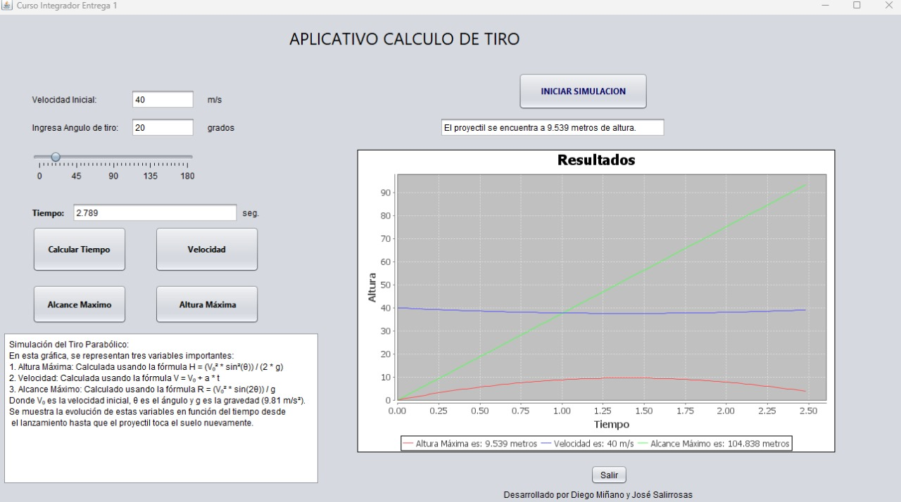

# Simulador de Movimiento Parabólico - Aplicación en Java

## Título del Proyecto
"Aplicación Demostrativa de la Trayectoria Parabólica Basada en las Leyes de Newton para Optimizar Resultados"

## Introducción
### 1.1 Descripción del Problema
En Perú, los entrenadores y jugadores en deportes como el baloncesto, el fútbol y el voleibol enfrentan desafíos para optimizar técnicas de lanzamiento, pase y tiro debido a una comprensión limitada de la trayectoria parabólica. La falta de herramientas accesibles que integren principios científicos con la práctica deportiva limita la capacidad para analizar y mejorar técnicas basadas en datos precisos.

### 1.2 Objetivos
#### 1.2.1 Objetivo General
Desarrollar una aplicación que permita simular y visualizar la trayectoria parabólica de una pelota, facilitando a entrenadores y atletas la mejora de técnicas de juego mediante una representación gráfica y datos clave.

#### 1.2.2 Objetivos Específicos
- Calcular y visualizar la velocidad de la pelota.
- Determinar la posición de la pelota a lo largo del tiempo.
- Calcular el tiempo de vuelo, el rango máximo y la altura máxima alcanzada.
- Proporcionar una simulación gráfica para la comprensión de la mecánica del lanzamiento.

### 1.3 Alcance y Limitaciones
#### 1.3.1 Alcance
- La aplicación es una herramienta de escritorio que permite ingresar parámetros y visualizar resultados de la trayectoria parabólica.
- La simulación es adaptable a varios deportes, con cálculos personalizados para cada uno.

#### 1.3.2 Limitaciones
- La aplicación no está disponible en dispositivos móviles ni en entornos web.

### 1.4 Justificación
Este proyecto busca mejorar el rendimiento deportivo al proporcionar una herramienta precisa para calcular trayectorias parabólicas, facilitando la integración de principios físicos en el entrenamiento y mejorando las técnicas de los atletas.

## Fundamento Teórico
### 2.1 Marco de Programación Orientada a Objetos
#### 2.1.1 Apache NetBeans IDE
Apache NetBeans es un IDE de código abierto que ofrece herramientas avanzadas para el desarrollo en Java y otros lenguajes, facilitando la edición de código, depuración y diseño de interfaces de usuario.

#### 2.1.2 Conceptos de Programación Orientada a Objetos
- **Clases y Objetos**
- **Encapsulamiento**
- **Herencia**
- **Polimorfismo**
- **Interfaces**

### 2.2 Marco Teórico de las Fórmulas
Las fórmulas utilizadas para el análisis del movimiento parabólico incluyen:
- **Movimiento Horizontal:** Velocidad constante en la dirección horizontal.
- **Movimiento Vertical:** Aceleración debida a la gravedad.
- **Posición de la Trayectoria:** Determinada por las ecuaciones de posición en función del tiempo.
- **Tiempo de Vuelo, Altura Máxima y Alcance:** Calculados usando las fórmulas derivadas de las leyes de Newton.

## Imágenes
A continuación se presentan imágenes que ilustran diferentes aspectos de la aplicación:

1. **Diagrama de Casos:** 
2. **Vista del Aplicativo:** 
3. **Cálculo de la Velocidad:** 
4. **Vista de Altura Máxima:** 
5. **Cálculo del Tiempo en el Aire:** 
6. **Cálculo del Alcance Máximo:** 

## Instalación
1. **Requisitos Previos:**
   - [Java SE Development Kit (JDK) 8 o superior](https://www.oracle.com/java/technologies/javase-downloads.html)
   - [Apache NetBeans IDE 12 o superior](https://netbeans.apache.org/download/index.html)
   - [JFreeChart JAR](http://www.jfree.org/jfreechart/)

2. **Pasos de Instalación:**
   - Descargue e instale el JDK desde el enlace proporcionado.
   - Descargue e instale Apache NetBeans IDE desde el enlace proporcionado.
   - Descargue el JAR de JFreeChart desde [aquí](http://www.jfree.org/jfreechart/) y colóquelo en el directorio `lib` del proyecto.
   - Abra el proyecto en Apache NetBeans IDE.
   - Compile y ejecute el proyecto desde el IDE.

## Uso
1. Ingrese los parámetros requeridos en la sección de entrada.
2. Haga clic en el botón de cálculo para generar los resultados.
3. Visualice la trayectoria parabólica en el gráfico y los datos numéricos en la sección de resultados.

## Contribuciones
Si desea contribuir al proyecto:
1. Haga un fork del repositorio.
2. Realice sus cambios en una rama separada.
3. Envíe un pull request con una descripción clara de los cambios realizados.

## Licencia
Este proyecto está bajo la Licencia MIT. Para más detalles, consulte el archivo [LICENSE](LICENSE).

## Contacto
Para preguntas o comentarios, puede contactar a:
- [Gatorrante](mailto:diegoalonso970@outlook.com)
